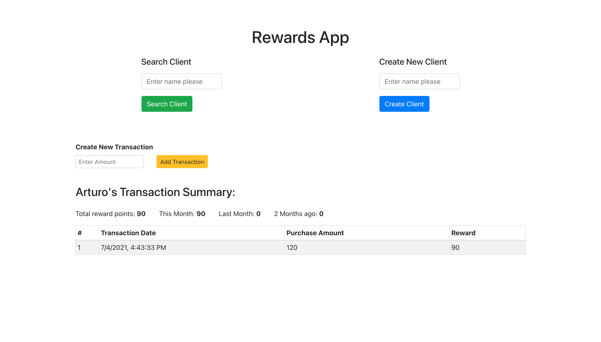

# React Project

>  Rewards Problem

## Problem Instructions

> A retailer offers a rewards program to its customers, awarding points based on each recorded purchase.
> A customer receives 2 points for every dollar spent over $100 in each transaction, plus 1 point for every dollar spent over $50 in each transaction
> (e.g. a $120 purchase = 2x$20 + 1x$50 = 90 points).
> Given a record of every transaction during a three month period, calculate the reward points earned for each customer per month and total.

## Built With

- React
- Bootstrap

## Screenshot

## Live Demo

[Live Demo Link](http://torresbribiesca.tech/rewards-react/)

## Author

### 👨‍💻 Jorge Torres

- Github: [Jorge Torres](https://github.com/Yors-git)
- Linkedin: [Jorge Torres](https://www.linkedin.com/in/jtbribiesca/)
- Twitter: [@Yors_82](https://twitter.com/Yors_82)

### 🤝 Contributing

Contributions, issues and feature requests are welcome!

### Show your support

Give a ⭐️ if you like this project!

### License

This project belongs to Jorge Torres, all rights reserved.